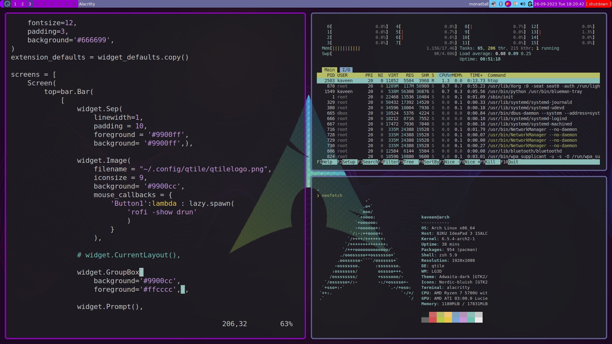

# Qtile Config
## Table of Content
- [About](About)
- [Screenshot](Screenshot,)
- [Structure](Structure)
- [Conclusion](Conclusion)
  
### About
- A few weeks ago I decided to completely move on tiling window managers.
- And I decided to use Qtile as my first window manager.
- So this is the config file I created for my personal use.
  
### Screenshot,


>[!NOTE]
>To install this config, check [KLinux repository](https://github.com/kaveen-lakmuthu/KLinux)

### Structure
- Every config about Qtile is written in the `~/.config/qtile/config.py`  file.
- Autostart programmes are in `~/.config/qtile/autostart_once.sh` file.
```
#!/bin/sh
picom &
lxsession &
redshift-gtk -l 6:79 &
volumeicon &
nm-applet &
nitrogen --restore &
blueman-applet &
xfce4-power-manager &
dunst &
/usr/bin/emacs --daemon &
flameshot &
light-locker &
polkit &
```
- If you want to change autostart programs, you can edit this file.
- `autostart_once.sh` file is called on `config.py` file.
```
def autostart_once():
    subprocess.run('/home/kaveen/.config/qtile/autostart_once.sh')
```
- Replace `kaveen` with your username.
> [!IMPORTANT]
> Changes about transparency needed to be done by picom.
> Those configs are not included with KLinux script yet.

### Conclusion
- Thank you for checking this repository.
- Enjoy this configuration for Qtile.

